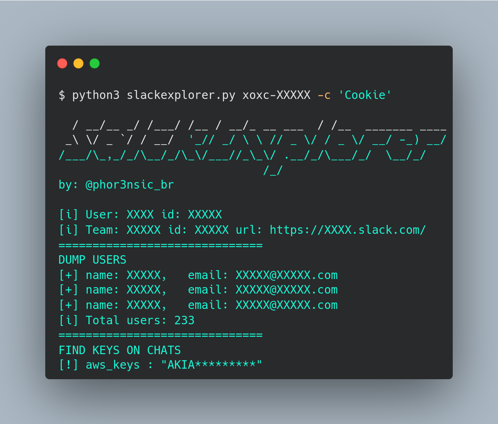

# SlackExplorer
 [](https://twitter.com/phor3nsic_br)


SlackExplorer is a tool designed to explore exposed tokens from Slack users or sessions. 

This tool will perform a dump of workspace users and search for exposed credentials in chats.

## Installation
To install SlackExplorer, follow the steps below:

1. Clone the repository:

```bash
git clone https://github.com/<username>/slackexplorer.git
```

2. Install the required dependencies:

```bash
pip install -r requirements.txt
```

## Usage
To use SlackExplorer, follow the steps below:

1. Navigate to the SlackExplorer directory:
```bash
cd slackexplorer/
```
2. Run the tool:

> Without cookie
```bash
python3 slackexplorer.py TOKEN
```

> With cookie
```bash
python3 slackexplorer.py TOKEN -c 'COOKIES'
```
3. Wait for the tool to perform a dump of the workspace users and search for exposed credentials in chats.


## Disclaimer
SlackExplorer should only be used for ethical purposes, such as identifying and fixing security vulnerabilities in your own Slack workspace. The tool should not be used for malicious purposes, such as stealing credentials or accessing sensitive information. The author of this tool is not responsible for any illegal or unethical use of the tool.
